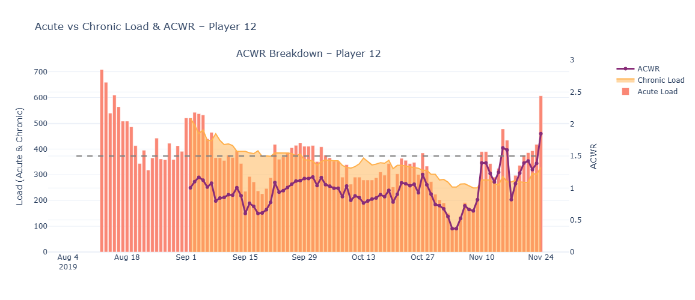

# 🏃‍♂️ ACWR Analysis Using Wearable Data for Soccer Players

This mini-project analyzes **Acute to Chronic Workload Ratio (ACWR)** for soccer players using wearable device data. ACWR is a widely used metric in sports science to monitor training loads and assess **injury risk** by comparing short-term (acute) and long-term (chronic) workloads.

---

## 📊 Project Objective

- To calculate **ACWR** per player using 7-day (acute) and 28-day (chronic) workload windows.
- To **resample** player-level training data to ensure consistency and account for missing dates.
- To **flag players at risk** of over-training or under-training based on ACWR thresholds.
- To **visualize** player load trends and risk zones across a season.

---

## 🧠 What is ACWR?

**ACWR** = (Total Load over past 7 days) / (Average Load over past 28 days)

- **High risk**: ACWR > 1.5 (overtraining risk)
- **Low risk**: ACWR < 0.3 (undertraining risk)
- **Optimal zone**: 0.8 ≤ ACWR ≤ 1.3

This project uses **Player Load** as the training load metric collected through GPS wearables.

---

## 🔧 Tools Used

- **Python**
  - `pandas` – data cleaning & resampling
  - `matplotlib` / `plotly` – visualizations

---

## 🔎 Methodology Overview

1. **Filter Sessions Only**  
   Only rows labeled `"Session"` in the `Period.Name` column are used.

2. **Per-Player Resampling**  
   Ensured each day exists in the timeline, even if the player didn't train.

3. **Calculate Acute & Chronic Loads**  
   - **Acute**: 7-day average of `Total.Player.Load`
   - **Chronic**: 28-day average of `Total.Player.Load`

4. **Compute ACWR Ratio**  
   - Add risk flag column: `Over training`, `Optimum`, or `Under training`

5. **Visualize**  
   - Daily load trends
   - ACWR vs. Thresholds

---

## 📈 Sample Visual

*Player 12’s daily load and ACWR trend.*

---

## 🚩 Risk Flag Legend

| Flag     | Condition         | Meaning                |
|----------|-------------------|------------------------|
| 🔴 Over training   | ACWR > 1.5  | At risk of overtraining |
| 🟡 Optimum | 0.3 < ACWR < 1.5    | Safe/Optimal zone       |
| 🔵 Under training    | ACWR < 0.3| At risk of undertraining|

---

## 📬 Contact

Made by Sachin Kumar Gupta  
🔗 [LinkedIn](https://www.linkedin.com/in/sachingupta-ds) | 🧠 [Portfolio](https://public.tableau.com/app/profile/sachingupta)

---
